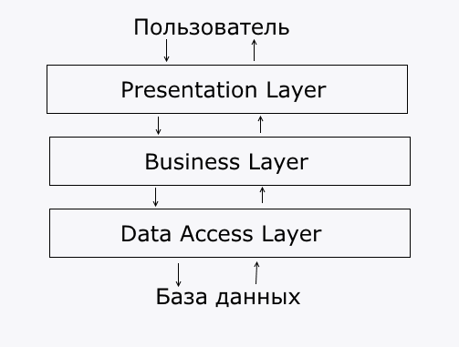
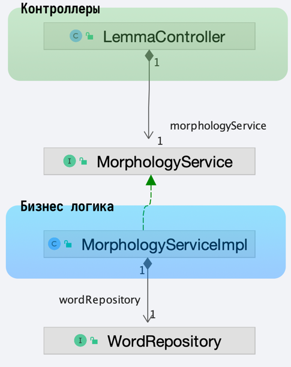

# Пример проекта Java Spring Framework

Проект с подключенными библиотеками лемматизаторами.
Содержит несколько контроллеров, сервисов и репозиторий
с подключением к бд MySQL.

## Настройки для запуска

### Зависимости

Для успешного скачивания и подключения к проекту зависимостей
из GitHub необходимо настроить Maven конфигурацию в файле `settings.xml`.

А зависимостях, в файле `pom.xml` добавлен репозиторий для получения
jar файлов:

```xml
<repositories>
  <repository>
    <id>skillbox-gitlab</id>
    <url>https://gitlab.skillbox.ru/api/v4/projects/263574/packages/maven</url>
  </repository>
</repositories>
```

Так как для доступа требуется авторизации по токену для получения данных из
публичного репозитория, для указания токена, найдите файл `settings.xml`.

* В Windows он располагается в директории `C:/Users/<Имя вашего пользователя>/.m2`
* В Linux директория `/home/<Имя вашего пользователя>/.m2`
* В macOs по адресу `/Users/<Имя вашего пользователя>/.m2`

>**Внимание!** Актуальный токен, строка которую надо вставить в тег `<value>...</value>`
[находится в документе по ссылке](https://docs.google.com/document/d/1rb0ysFBLQltgLTvmh-ebaZfJSI7VwlFlEYT9V5_aPjc/edit?usp=sharing). 

и добавьте внутри тега `settings` текст конфигурации:

```xml
<servers>
  <server>
    <id>skillbox-gitlab</id>
    <configuration>
      <httpHeaders>
        <property>
          <name>Private-Token</name>
          <value>token</value>
        </property>
      </httpHeaders>
    </configuration>
  </server>
</servers>
```

**Не забудьте поменять токен на актуальный!**

❗️Если файла нет, то создайте `settings.xml` и вставьте в него:

```xml
<settings xmlns="http://maven.apache.org/SETTINGS/1.0.0"
          xmlns:xsi="http://www.w3.org/2001/XMLSchema-instance"
          xsi:schemaLocation="http://maven.apache.org/SETTINGS/1.0.0
 https://maven.apache.org/xsd/settings-1.0.0.xsd">

  <servers>
    <server>
      <id>skillbox-gitlab</id>
      <configuration>
        <httpHeaders>
          <property>
            <name>Private-Token</name>
            <value>token</value>
          </property>
        </httpHeaders>
      </configuration>
    </server>
  </servers>

</settings>
```

ℹ️ [Пример готового settings.xml лежит](settings.xml) в корне этого проекта.


**Не забудьте поменять токен на актуальный!**

После этого, в проекте обновите зависимости (Ctrl+Shift+O / ⌘⇧I) или
принудительно обновите данные из pom.xml. 

Для этого вызовите контекстное
у файла `pom.xml` в дереве файла проектов **Project** и выберите пункт меню **Maven -> Reload Project**.


⁉️ Если после этого у вас остается ошибка:

```text
Could not transfer artifact org.apache.lucene.morphology:morph:pom:1.5
from/to gitlab-skillbox (https://gitlab.skillbox.ru/api/v4/projects/263574/packages/maven):
authentication failed for
https://gitlab.skillbox.ru/api/v4/projects/263574/packages/maven/russianmorphology/org/apache/
    lucene/morphology/morph/1.5/morph-1.5.pom,
status: 401 Unauthorized
```

Почистите кэш Maven. Самый надежный способ, удалить директорию:

- Windows `C:\Users\<user_name>\.m2\repository`
- macOs `/Users/<user_name>/.m2/repository`
- Linux `/home/<user_name>/.m2/repository`

где `<user_name>` - имя пользователя под которым вы работаете.

После этого снова попробуйте обновить данный из `pom.xml`

### Настройки подключения к БД

В проект добавлен драйвер для подключения к БД MySQL. Для запуска проекта,
убедитесь, что у вас запущен сервер MySQL 8.x.

🐳 Если у вас установлен докер, можете запустить контейнер с готовыми настройками
под проект командой:

```bash
docker run -d --name=springLemmaExample -e="MYSQL_ROOT_PASSWORD=Kimk7FjT" -e="MYSQL_DATABASE=lemma" -p3306:3306 mysql
```

Имя пользователя по-умолчанию `root`, настройки проекта в `src/resources/application.yml`
соответствуют настройкам контейнера, менять их не требуется.

❗️ Если у вас MacBook c процессором M1, необходимо использовать специальный
образ для ARM процессоров:

```bash
docker run -d --name=springLemmaExample -e="MYSQL_ROOT_PASSWORD=Kimk7FjT" -e="MYSQL_DATABASE=lemma" -p3306:3306 arm64v8/mysql:oracle
```

Если используете MySQL без докера, то создайте бд `lemma` и замените логин и пароль
в файле конфигурации `src/resources/application.yml`:

```yaml
spring:
  datasource:
    username: root # имя пользователя
    password: Kimk7FjT # пароль пользователя
```

После этого, можете запустить проект. Если введены правильные данные,
проект успешно запуститься. Если запуск заканчивается ошибками, изучите текст
ошибок, внесите исправления и попробуйте заново.

## Структура проекта

В нашем случае будем придерживаться простой слоистой структуре (еще можно назвать "луковичная"). У нас есть
три слоя:

* **Presentation** - Наши контроллеры. слой общается с пользователями, в нашем случае ожидает запросы по API. И отдает
  ответы.
* **Business** - замый важный слой - бизнес логика, содержится в классах Сервисах. Этот слой ничего не знает о
  Presentation
  слое
* **Data Access** - слой отвечает за хранение данных, подключение к БД, реализацию запросов. Слой не знает о других
  слоях
  ничего. У нас это классы Репозитории.



Каждый слой занимается только своими задачами и работа одного слоя не должна перетекать в другой. Например, Контроллер
должен только получать данные от пользователя и вызывать нужный сервис, не более. Все расчеты и проверки должны быть в
классах сервисах.

Если посмотреть слои данного приложения, то увидим не только сами классы, но еще и интерфейсы между ними.



Интерфейсы нужны, чтобы слои приложения не зависели от реализаций классов. Каждый из классов LemmaController и
MorphologyServiceImpl зависят от интерфейса MorphologyService. Это значит, что сервисы и контроллеры могут меняться
независимо, заменяться и это не будет влиять на другие слои.

Также это относится и к передаваемым данным, у каждого слоя
может быть свои структуры для хранения данных, например Репозитории отдают Entity классы, а сервисы уже упаковывают в
нужные объекты, снова для того чтобы конечный потребитель данных не зависел напрямую от структуры данных в БД. БД может
измениться, поменять структуру таблиц - и это должно произойти максимально незаметно для других слоев.

Если еще раз посмотреть на схему, самой реализации Data Access слоя нет, у нас есть только интерфейс репозитория, а
реализация будет сгенерирована при запуске проекта.

Рекомендации для чтения про архитектуру:

* [Многоуровневая архитектура в проекте на Java (Часть 1)](https://alexkosarev.name/2018/07/27/n-tier-java-part1/)
* [Многоуровневая архитектура в проекте на Java (Часть 2)](https://alexkosarev.name/2018/07/27/n-tier-java-part2/)
* [Чистая архитектура](https://habr.com/ru/post/269589/)

## Исследуйте исходный код проекта

К классам и методам в проекте содержаться комментарии объясняющие особенности поведения, использование аннотаций и
синтаксис. Пройдитесь по всем классам и изучите проект.

## Проверка API

Для проверки API данного проекта вы можете использовать разные инструменты:

* [cURL](https://curl.se/) - консольная утилита.
* [Postman](https://www.postman.com/) - приложения для отправки запросов и тестирования API
* [Insomnia](https://insomnia.rest/) - еще одно приложения для тестирования API

Ниже приведены запросов в формате cURL, вы можете данные из запросов перенести в любое другое приложение.

* **Получение информации о слове**

```bash
curl -X POST http://localhost:8080/api/lemma/info  -i -d '{"word":"брат"}' -H 'Content-Type: application/json'
```

Успешный ответ:

```json
[
  "брат|A С мр,ед,им"
]
```

* **Сохранение слова в БД**

```bash
curl -X POST http://localhost:8080/api/lemma/save -i -d '{"word":"сестра"}' -H 'Content-Type: application/json'
```

Успешный ответ:

```json
{
  "word": "сестра",
  "morphInfo": [
    "сестра|G С жр,ед,им"
  ]
}
```

Слово не найдено с словаре:

```json
{
  "message": "Word <cecnhf> not contains in dictionary!"
}
```

* **Поиск слова в БД**

```bash
curl  -X POST http://localhost:8080/api/lemma/search -i -d '{"query":"бр", "limit":100}' -H 'Content-Type: application/json'
```

Успешный ответ:

```json
{
  "count": 2,
  "words": [
    {
      "word": "брат",
      "morphInfo": "[брат|A С мр,ед,им]",
      "count": 0
    },
    {
      "word": "броненосец",
      "morphInfo": "[броненосец|A С мр,ед,им]",
      "count": 0
    }
  ]
}
```
